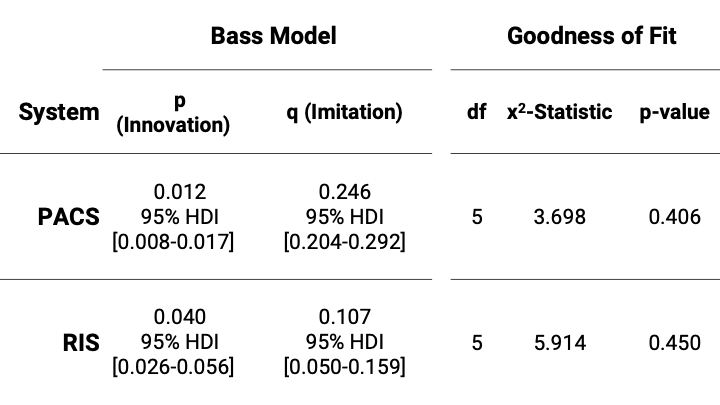
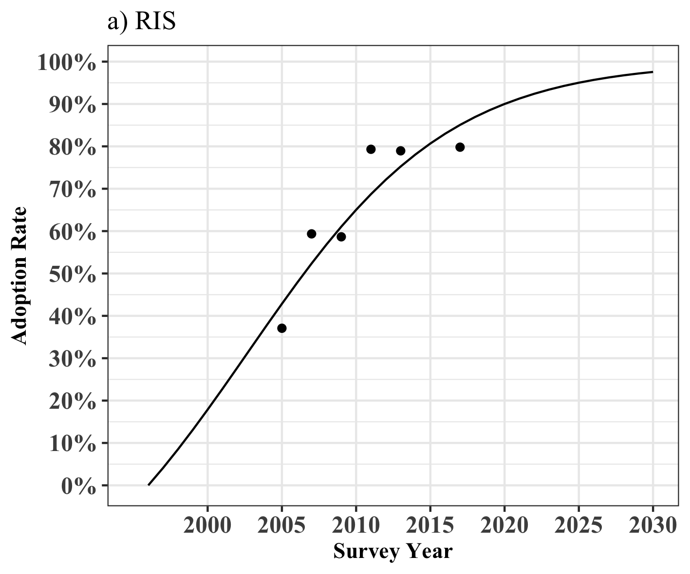
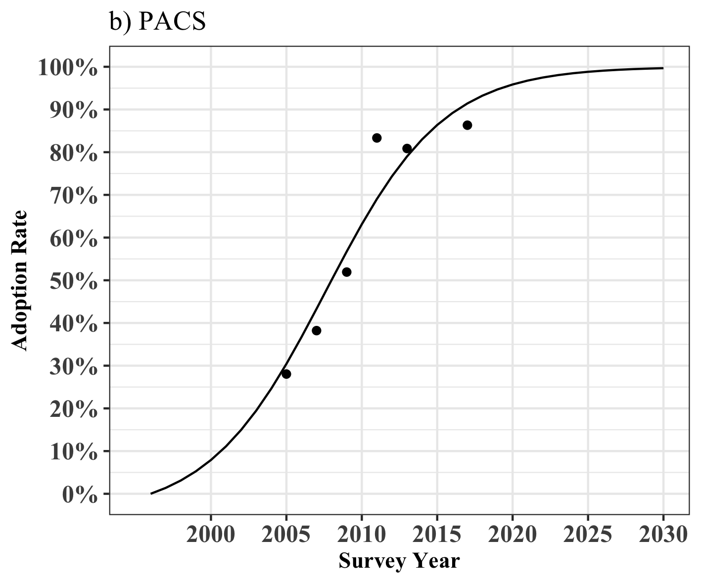
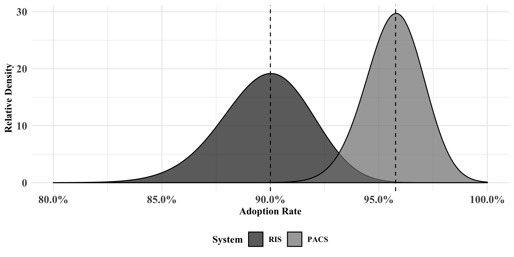
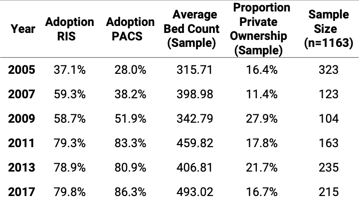

```{r setup, include=FALSE}

options(htmltools.dir.version = FALSE)

library(RefManageR)
library(tidyverse)
knitr::opts_chunk$set(fig.retina = 3, warning = FALSE, message = FALSE)
biblio <- RefManageR::ReadBib(file = "bib/gmds19-talk.bib")
```

```{r bib, eval=FALSE, include=FALSE}

# list keys
biblio %>%  
  as.data.frame %>% 
  select(title)

```

layout: false

# In the upcoming minutes...

.pull-right[

## What to expect

- Showcase a Bayesian Bass Model which outlines the diffusion curve of RIS and PACS systems.

- Present the predicted uptake of RIS and PACS in 2020

]

.qrcode[

]

.bottom[ 
  .large[.red[!] A detailled description and an implementation for R can be found on [github]() `r icon::fa("github")`] 
]
---

layout: false

# History and Motivation

.pull-left[

.center[

]

```{r, echo = FALSE, fig.height = 4.5}
library(s1302itr)

haven::read_sav("~/Downloads/CIO_Final_D.sav") %>% 
  select(LBV1SQ003) %>% 
  mutate_at("LBV1SQ003", relabel_spss_variable) %>% 
  group_by(LBV1SQ003) %>% 
  count() %>% 
  filter(!is.na(LBV1SQ003)) %>% 
  ungroup() %>% 
  mutate(nn = sum(n)) %>% 
  mutate(prop = n / nn) %>% 
  rename(response = LBV1SQ003) %>% 
  plot_singlebar() +
  ggtitle("Adoption of PACS in 2016") +
  scale_y_continuous(labels = scales::percent, limits = 0:1, breaks = seq(0, 1, by = .2)) +
  theme(text = element_text(size = 20),
        axis.text.x = element_text(size = 16),
        axis.text.y = element_text(size = 16)) 
  
```
]

--

.pull-right[

```{r aha-longi, echo = FALSE}

read_csv2("data/aha_data.csv") %>% 
  gather(key, value, -X1) %>% 
  filter(key == "Comprehensive or Basic (most often reported)") %>% 
  mutate(year = lubridate::ymd(paste0(X1, "-01-01"))) %>% 
  mutate(value = value/100) %>% 
  ggplot(aes(x = year, y = value)) +
  geom_point(size = 6, shape = 19) +
  geom_line(size = 2, linetype = 2) +
  scale_y_continuous(labels = scales::percent, limits = 0:1) +
  theme_minimal() +
  ggtitle("Diffusion Curve of EHR in U.S. Hospitals", subtitle = "Data Source: AHA ONC Brief") +
  ylab("Propotion of Adopters") +
  xlab("Year") +
  theme(text = element_text(size = 18))

```
 
]

---

# RIS and PACS

.large[

- Radiology is an innovation-friendly and IT savvy medical domain

- RIS and PACS were among the first IT-systems in hospitals and widely accepted

- Radiology is expected to witness profund disruptions 

]

---

layout: false
class: left, top
background-image: url(./img/roger-doi-theory.png)
background-size: 60%
background-position: center


# Rogers' Diffusion of Innovation Theory

<link rel="stylesheet" href="https://use.fontawesome.com/releases/v5.2.0/css/all.css" integrity="sha384-hWVjflwFxL6sNzntih27bfxkr27PmbbK/iSvJ+a4+0owXq79v+lsFkW54bOGbiDQ" crossorigin="anonymous">


.bottom[The Diffusion Process, Image taken from: `r RefManageR::Citet(biblio, "rogers_diffusion_1983")`]

---

# Bass Diffusion Model

<iframe src="https://jnshsrs.shinyapps.io/bass-coeficients/" 
name="iframe1" id="iframe1"
style="border-style: none; width: 100%; height: 800px;"></iframe>

.pull-right[[Shiny Application](jnshsrs.shinyapps.io/bass-coeficients/)]


---

# Results - Coefficients

.pull-left[
.center[
```{r echo = FALSE, fig.height=5.5, fig.width=5.5}
pacs <- readRDS("./data/pacs.rds")
ris <- readRDS("./data/ris.rds")

bind_rows(
  list(
    "PACS" = pluck(pacs, "rjags_chains"),
    "RIS" = pluck(ris, "rjags_chains")
  ),
  .id = "system"
) %>% 
  gather(key, value, -system) %>% 
  mutate(key = factor(x = key,
                      levels = c("p", "q"),
                      labels = c("p - Coefficient of Innovation", "q - Coefficient of Imitation"))) %>% 
  # unite(system_key)
  ggplot(aes(x = value, fill = key)) +
  geom_density(alpha = .7, bw = .007) +
  facet_wrap(~system, ncol = 1) +
  scale_x_continuous("Value of Coefficients", limits = c(-.01, .3), breaks = seq(0, .3, by = .05)) +
  scale_fill_discrete("Coefficients") +
  theme_minimal() +
  theme(legend.position = "bottom",
        strip.text = element_text(size = 13),
        legend.direction = "vertical",
        plot.title = element_text(size=22),
        axis.text = element_text(size = 12),
        axis.title = element_text(size = 12)) +
  ggtitle("Posterior Distributions", subtitle = "for Model Coefficients p and q")

```
]
]

.bottom[The Bayesian Bass Diffusion Model provides a complete probability distribution of the model parameters.]

--

.pull-right[
.center[

]
]


---

# Results - Diffusion Curves

.pull-left[



]

.pull-right[



]

.bottom[The figures show the diffusion process for a) RIS and b) PACS]
---

layout: false

# Discussion of Findings

.large[

- RIS uptake correlated with EHR adoption 

- PACS uptake may correlate with purchase of state-of-the-art modalities


]

---

# Results - Prediction of Adoption in 2020




---

# Headlines


<br/>

## We successfully combied the Bass Diffusion Model with Bayesian Statistics

<br/>

## RIS and PACS are expected to be implemented at least in 90% of German hospitals in 2020

<br/>


---
layout: false
class: left, top
background-image: url(./img/predicted-adoption-ehr-2020.png)
background-size: 70%
background-position: center

# Outlook Predicted EHR Adoption in 2020

---
<iframe src="https://www.sciencedirect.com/science/article/abs/pii/S1386505619302199" 
name="iframe1" id="iframe1"
style="border-style: none; width: 100%; height: 800px;"></iframe>

---
layout: true

# Discussion

- RIS and PACS are close on reaching full market penetration 

- Show paralell development with respect to diffusion

- Higher innovation coefficient with RIS and higher Imitation effect with PACS

---
layout: false

background-image: url(../img/logo-hs-os-kompakt.jpg), url(../img/logo-it-report.png);

.qrcode[

]

.center[

.very-large[Use Bayesian Statistics for your Data Analysis]
<br/>
.very-large[`r emo::ji("blush")`]
.

<a href="mailto:j.huesers@hs-osnabrueck.de">
.black[`r icon::fa("paper-plane")` j.huesers@hs-osnabrueck.de]
</a>

<a href="sciphy-stats.de">
.black[`r icon::fa("link")` sciphy-stats.de]
</a>


<a href="jnshsrs.github.io/bayesianbass/">
.black[`r icon::fa("link")` jnshsrs.github.io/bayesianbass/]
</a>

<a href="http://twitter.com/garthtarr">
.black[`r icon::fa("twitter")` @jnshsrs]
</a>

<a href="http://github.com/garthtarr">
.black[`r icon::fa("github")` @jnshsrs]
</a>

<br>
.pull-left[

]
.pull-left[

]
]

---

# Appendix

---

# Further Discussions 

- Deeper insights possible with longitudianal analysis and possibly more reliant, however data is harder to obtain.

- We made clear distinctions between RIS and PACS which starts being difficult (platform and cloud based architecture that merge functionalities).

- Often top-down governmental actions are considered to drive uptake, thus lognitudinal analyis may offer insights needed to develop politicial strategies.

- We published a similar analysis in of EHR diffusion dynamics in the International Journal of Medical Informatics.

---

## Descriptive Table
.center[

]

---

## Bayes' Rule

.center[
.large[
$p(Hypothesis|Data)=\frac{p(Hypothesis)p(Data|Hypothesis)}{p(Data)}$
]
]

## Bass Diffusion Model

.center[.large[
$F(t) = 1 - \frac{e^{-(p + q)t}}{1 + \frac{q}{p}e^{-(p+q)t}}$
]]

---

## Bayesian Bass Diffusion Model - Bayesian Likelihood

```{r show-model, tidy = T, eval = FALSE, error=TRUE}

# RJAGS model definition
model {
  
  # Likelihood Function (Generative Model)
  for(i in 1:N) {
    mu[i] <- (1 - exp(-(p + q) * t[i])) / (1 + (q / p) * exp(-(p + q) * t[i]))
    y[i] ~ dbern(mu[i])
  }
  
  # Priors of Model Parameters
  p ~ dnorm(.0001, .6)
  q ~ dnorm(.0001, .6)
}

````

.bottom[The likelihood is the probability of the data given a specific set of parameters $p(Data|Hypothesis)$ ]

---

## Priors

.center[
```{r fig.height=4, echo = FALSE}
library(tidyverse)
rnorm(n = 3000, .0001, .6) %>% 
  enframe(name = NULL) %>% 
  ggplot(aes(x = value)) +
  geom_density(bw = .4, fill = "grey50", alpha = .5) +
  theme_minimal() +
  xlab("Prior Probability Distribution of both coefficients, p and q") +
  ylab("Density") +
  theme(text = element_text(size = 15),
        axis.text = element_text(size = 15))
  
```
]
